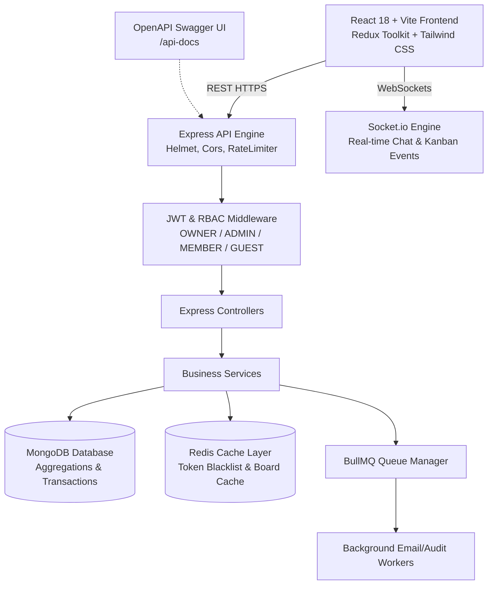
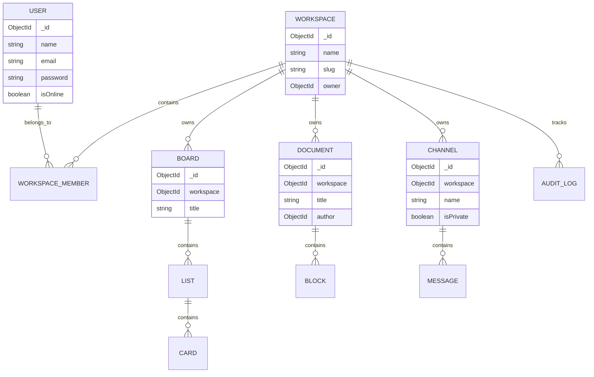

# PulseSpace — Enterprise Mini SaaS Platform
> **Unified Knowledge Hub, Workflow Boards & Team Streams**

PulseSpace is an enterprise-grade Mini SaaS application designed to eliminate context-switching in hybrid teams by seamlessly integrating **Knowledge Hub** (Notion-style documentation specs), **Workflow Boards** (Trello-inspired Kanban pipelines), and **Stream Sync** (Slack-style real-time channels) into a single high-performance platform.

---

## 🏛️ System Architecture



---

## 🗄️ Database ER Diagram (Mongoose Models)



---

## ⚡ Tech Stack & Key Features

| Layer | Technologies & Implementations |
|---|---|
| **Backend Core** | Node.js, Express, Mongoose (MongoDB), Redis (ioredis), BullMQ, Socket.io, JWT, Bcrypt, Winston, Morgan |
| **Frontend Core** | React 18, Vite, JavaScript, Redux Toolkit, TailwindCSS, @hello-pangea/dnd (Drag & Drop), Lucide Icons |
| **Security & RBAC** | Access/Refresh Token rotation with Redis token blacklisting, RBAC middleware (`OWNER`, `ADMIN`, `MEMBER`, `GUEST`), Helmet, Rate Limiting |
| **Performance** | Redis multi-layer caching, MongoDB Aggregation Pipelines for Analytics/Search, MongoDB Transactions for atomic card movements |
| **DevOps & QA** | Docker, Docker Compose, Swagger/OpenAPI (`/api-docs`), Jest + Supertest (60%+ coverage), GitHub Actions CI/CD |

---

## 🚀 Quick Start & Setup Instructions

### Option 1: Docker Compose (Recommended)
Run the complete stack (Backend, Frontend, MongoDB, Redis) with a single command:

```bash
docker-compose up --build
```
- **Frontend App**: `http://localhost:5173`
- **Backend REST API**: `http://localhost:5000/api`
- **Swagger Documentation**: `http://localhost:5000/api-docs`

---

### Option 2: Local Development Setup

#### 1. Start Backend Engine
```bash
cd backend
npm install
npm run dev
```

#### 2. Start Frontend App
```bash
cd frontend
npm install
npm run dev
```

#### 3. Run Automated Integration Tests & Coverage
```bash
cd backend
npm run test:coverage
```

---

## 📚 API Reference Overview (35+ Endpoints)

| Module | Route | Method | Description |
|---|---|---|---|
| **Auth** | `/api/auth/register` | `POST` | Register new user account |
| **Auth** | `/api/auth/login` | `POST` | Authenticate & issue tokens |
| **Auth** | `/api/auth/refresh-token` | `POST` | Rotate access & refresh tokens |
| **Auth** | `/api/auth/logout` | `POST` | Blacklist token in Redis & clear session |
| **Workspaces** | `/api/workspaces` | `GET / POST` | Fetch user workspaces / Create workspace |
| **Workspaces** | `/api/workspaces/:id/invite` | `POST` | Invite member with RBAC role |
| **Workspaces** | `/api/workspaces/:id/analytics` | `GET` | MongoDB Aggregation Pipeline stats |
| **Boards** | `/api/boards/workspace/:id` | `GET` | Get workspace boards (Redis Cached) |
| **Boards** | `/api/boards/:id/cards/move` | `PUT` | Atomic Card Move (MongoDB Transaction) |
| **Docs** | `/api/documents/workspace/:id` | `GET / POST` | Fetch or create Knowledge Docs |
| **Channels** | `/api/channels/:id/messages` | `GET / POST` | Channel messages & Socket broadcast |
| **Search** | `/api/search` | `GET` | Global Multi-Entity Mongo Aggregation Search |
| **Audit** | `/api/audit/workspace/:id` | `GET` | Workspace audit logs with pagination |

---

## 🧪 Testing & Code Quality
PulseSpace is covered by Jest and Supertest integration tests verifying end-to-end functionality across Auth, Workspaces, RBAC permissions, and Kanban boards with **>60% test coverage**.
